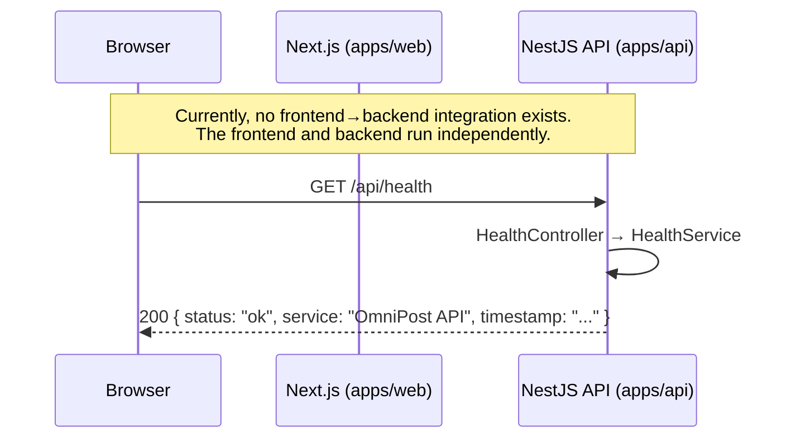
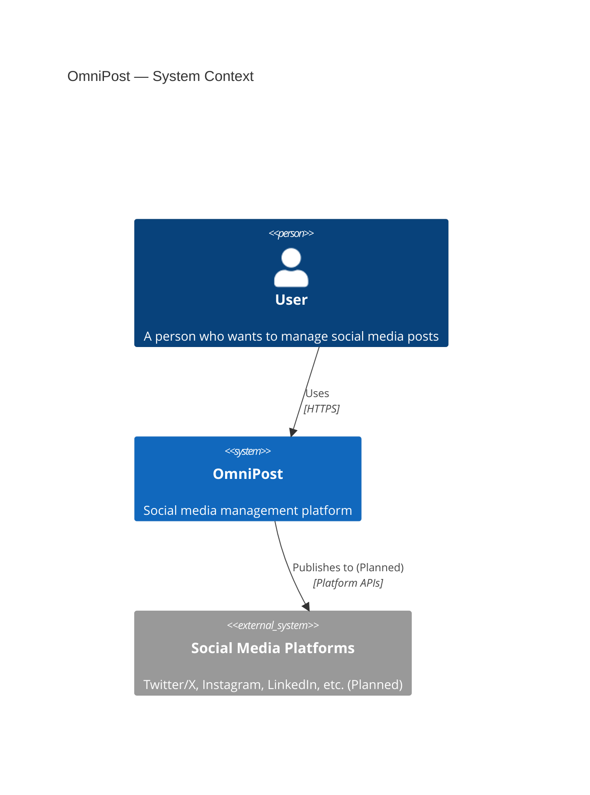
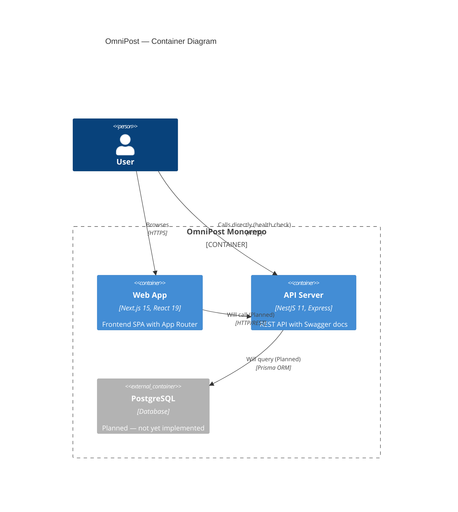
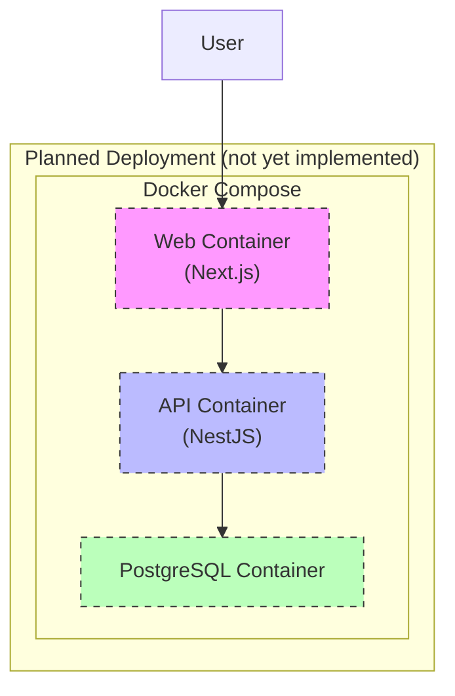

Status: Active
Owner: TBD
Last Updated: 2026-08-07
Dependencies: [Project Structure](./project-structure.md), [Backend](./backend.md), [Frontend](./frontend.md)

# Purpose

Describe the overall system architecture of OmniPost, including its current implementation and planned future components.

# Scope

This document covers the monorepo structure, frontend and backend applications, their interactions, and planned infrastructure. It includes C4-style diagrams at the Context, Container, and Sequence levels.

# Current State

## Project Overview

OmniPost is a social media management platform built as a **pnpm workspace monorepo**. The project currently consists of two applications and three shared packages:

- **`apps/web`** — Next.js 15 frontend (App Router, Tailwind CSS v4, Turbopack)
- **`apps/api`** — NestJS 11 backend (REST API with Swagger, health check module)
- **`packages/shared`** — Shared utilities, types, and constants (empty scaffold)
- **`packages/ui`** — Shared UI component library (empty scaffold)
- **`packages/config`** — Shared configuration for tooling (empty scaffold)

## Monorepo Architecture

The project uses a **pnpm workspace** to manage multiple packages and applications in a single repository. Workspaces are defined in `pnpm-workspace.yaml` and include `apps/*` and `packages/*`.

Key characteristics:
- **Package manager**: pnpm v11.15.1 (enforced via `packageManager` field in root `package.json`)
- **Workspace fan-out scripts**: Root `dev`, `build`, and `lint` scripts run across all workspaces via `pnpm --filter "*" --parallel`
- **No build orchestrator**: Turborepo or Nx are not currently used

## Frontend (Verified)

| Property | Value | Source |
|----------|-------|--------|
| Framework | Next.js 15.1.7 | `apps/web/package.json` → `next: ^15.1.7` |
| React | 19.0.0 | `apps/web/package.json` → `react: ^19.0.0` |
| Router | App Router | `apps/web/src/app/layout.tsx`, `page.tsx` |
| CSS | Tailwind CSS v4.0.7 | `apps/web/package.json` → `tailwindcss: ^4.0.7` |
| Dev server | Turbopack | `apps/web/package.json` → `"dev": "next dev --turbo"` |
| TypeScript | 5.7.3+ | `apps/web/package.json` → `typescript: ^5.7.3` |
| Linting | ESLint (flat config) | `apps/web/eslint.config.mjs` |

## Backend (Verified)

| Property | Value | Source |
|----------|-------|--------|
| Framework | NestJS 11 | `apps/api/package.json` → `@nestjs/core: ^11.0.0` |
| Platform | Express | `apps/api/package.json` → `@nestjs/platform-express: ^11.0.0` |
| API Docs | Swagger (dev only) | `apps/api/src/main.ts` lines 44–55 |
| Validation | Global `ValidationPipe` | `apps/api/src/main.ts` lines 33–42 |
| Security | Helmet, CORS | `apps/api/src/main.ts` lines 18, 27–30 |
| Config | `@nestjs/config` (global) | `apps/api/src/app.module.ts` lines 7–10 |
| TypeScript | 5.8.0+ | `apps/api/package.json` → `typescript: ^5.8.0` |
| Global prefix | `/api` | `apps/api/src/main.ts` line 15 |
| Default port | 3001 | `apps/api/.env.example` → `PORT=3001` |

## Request Flow (Current)

The only implemented request flow is the health check endpoint:



> **Note:** The Next.js frontend and NestJS backend are not yet connected. They run as independent applications. The sequence diagram above shows the only verified request path.

## Context Diagram



## Container Diagram



# Future Work

All items below are **planned** — they do not exist in the codebase today.

## Database Layer (Planned)

- **Prisma ORM** with **PostgreSQL** as the database engine
- See [ADR-0004](./adr/0004-use-prisma.md) for the decision rationale
- No Prisma dependency is installed; no schema file exists

## Infrastructure (Planned)

- **Docker** containerization for all services
- `infrastructure/docker/` directory exists but contains only a placeholder `README.md`
- No `Dockerfile`, `docker-compose.yml`, or similar files exist

## Extended Request Flow (Planned)

Once the database and frontend-backend integration are implemented, the anticipated flow will be:

```
Browser → Next.js → NestJS API → Prisma → PostgreSQL
```

This diagram will be updated when the integration is actually built.

## Deployment Diagram — Planned (Not Yet Implemented)



> ⚠️ **This diagram is entirely aspirational.** No Docker configuration, no deployment pipeline, and no PostgreSQL instance exist in the repository. It will be updated once `infrastructure/docker/` contains real configuration files.

## Database Diagram

To be added once the Prisma schema is implemented. No database schema exists in the repository today.

# References

- [Project Structure](./project-structure.md)
- [Backend](./backend.md)
- [Frontend](./frontend.md)
- [ADR-0001: Monorepo](./adr/0001-use-monorepo.md)
- [ADR-0004: Prisma](./adr/0004-use-prisma.md)
- [Roadmap](./roadmap.md)
